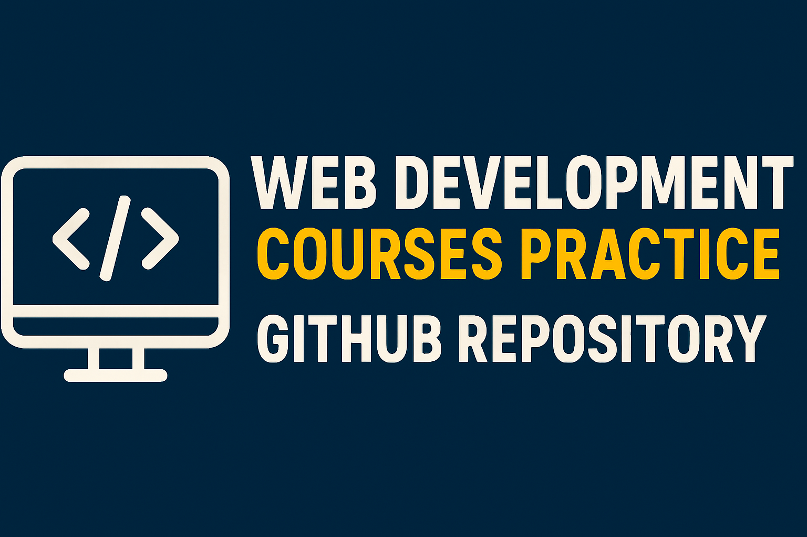

# WebDevelopmentCourses-Practice
This repository contains all the code I write while practicing various web development courses available across the internet.



## 🦁1️⃣ ReactJS Full Course | ReactJS - Learn Everything | Sheryians Coding School

* [02-Props-Cards-Project](https://webdevelopmentcourses-practice.onrender.com) project where cards are created dynamically using props.

